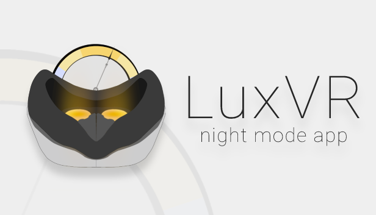
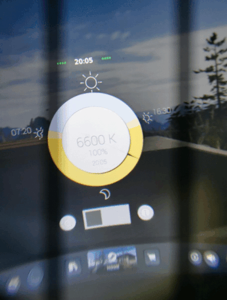

    

# LuxVR
 

## Overview

LuxVR is a night mode application for VR. It decreases blue light emitted by your head-mounted display (HMD) and reduces eyestrain during late hours or long time use in virtual reality. It makes the color of the HMD display adapt to the time of day with respect to your location to help you control your natural sleep-and-wake cycle. Just start the application and it will keep running in the background while you play other VR games/applications.

    
## Install
For the majority of users, it is recommended to simply install it through [Steam](https://store.steampowered.com/app/732230/LuxVR/).

## Demo

    

## Compatibility

LuxVR uses OpenVR SDK, which means that only some HMDs are natively supported, namely: Valve Index, HTC Vive, HTC Vive Pro. This application was tested on HTC Vive and Huawei VR2. 

[**Testers with other HMDs are welcome!**](##Contribution)

## Contribution

Community TODO List:
- Perform HMD tests.

| HMD | Status | Known Issues |
|-|-|-|
| HTC Vive | 🗹 | - |
| Huawei VR2 + Nolo CV1 | 🗹 | UI Sliders do not work as intended. See [this](https://github.com/benotter/OVRLay/issues/4). |
| Valve Index | ☐ | - |
| HTC Vive Pro | ☐ | - |
| HTC Vive Cosmos | ☐ | - |
| Oculus Rift | ☐ | - |
| Oculus Rift S | ☐ | - |

- Port to other platforms/operating systems. 

| Platform | Status | Known Issues |
|-|-|-|
| Windows | 🗹 | - |
| Linux | ☐ | - |
| Mac OS | ☐ | - |
| Quest/Sidequest | ☐ | - |

Please see [CONTRIBUTING.md](CONTRIBUTING.md) for more information.

## Donation

As an indie VR developer, researcher and open-source enthusiast, I love creating useful and free content for everyone. If you already like my work or would like to support my future endeavours, I appreciate literally any kind of support. 

- To support me financially, you can buy [donation DLCs](https://store.steampowered.com/dlc/732230/LuxVR/) through Steam or [send BTC](https://egemenertugrul.github.io/donate/).

---
*Unfortunately, my country is not supported for payments via PayPal/Stripe/etc.*

---
OR
- Fork the repo and make even greater stuff with it.
- Just spread the word around!

## Attribution

- [LightBulb](https://github.com/Tyrrrz/LightBulb) by Alexey Golub
- [OVRLay](https://github.com/benotter/OVRLay) by Ben Otter
- sunny, sunrise, sunset, Settings, Information by [Yarden Gilboa](https://thenounproject.com/yardenoon/) from the Noun Project
  
## License

LuxVR is released under terms of the [GPL v3](https://github.com/egemenertugrul/LuxVR/blob/main/LICENSE) license.

